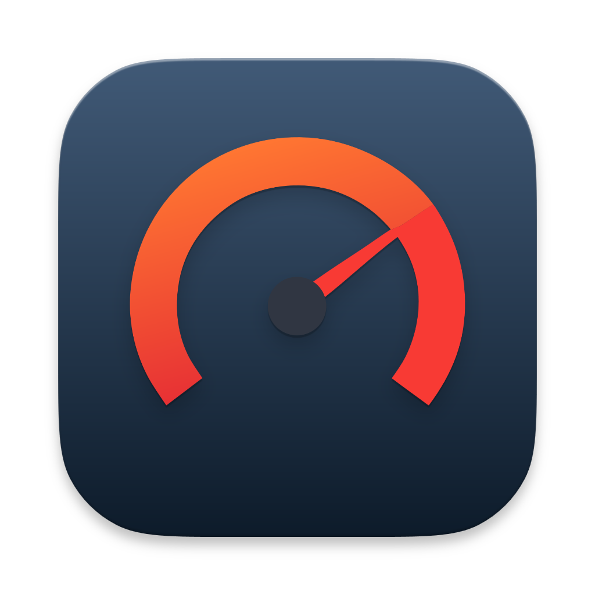
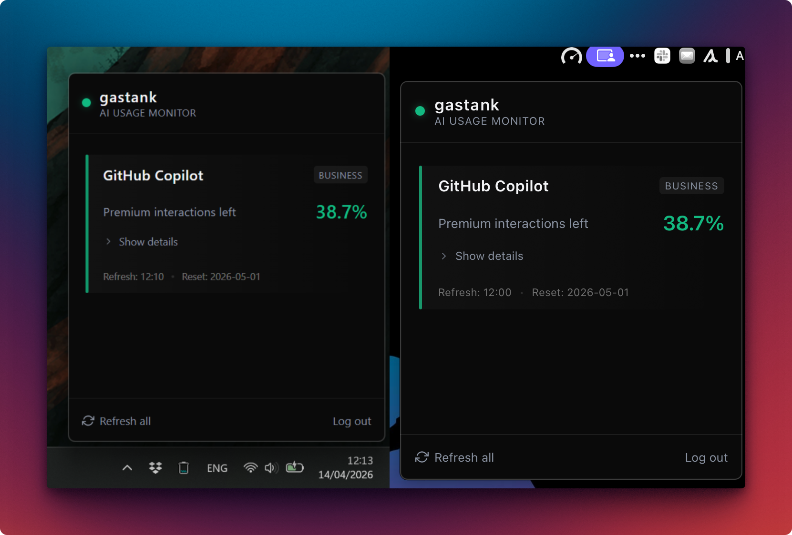

<!-- markdownlint-disable MD045 -->

<p align='center'>
  
</p>

<h1 align="center">Gastank</h1>

<h4 align='center'>
Gastank is a tiny cross-platform desktop menu bar / tray app for tracking AI usage across providers.
</h4>

<p align="center">
The name is a pun on Steve Yegge's <a href='https://github.com/gastownhall/gastown'>Gastown</a> project.
</p>

<p align='center'>
  
</p>

> [!NOTE]
> The first release supports Github Copilot. More providers will be added depending on need and how much I decide to care.

---

## Install & Run

### macOS / Linux

```bash
curl -fsSL https://raw.githubusercontent.com/donnaknows/gastank/main/scripts/install.sh | bash
```

### Windows

```powershell
iwr -useb https://raw.githubusercontent.com/donnaknows/gastank/main/scripts/install.ps1 | iex
```

Downloads and runs the NSIS installer.

### Manual download

Grab the latest release from [GitHub Releases](https://github.com/donnaknows/gastank/releases).

### Run

Search for "gastank" in your App list and simply start it. It will immediately go in your system tray / menu bar.

> [!HINT]
> Look for this icon: 

## CLI Usage

The binary includes a built-in CLI. Log in once via the GUI, then:

It's a bit janky at the moment, but it does its job, if for some arcane reason you need it.

```bash
gastank usage                  # fetch Copilot usage (JSON)
gastank usage github-copilot   # explicit provider name
gastank --version              # print version
gastank --help                 # show help
```

## Development

### Prerequisites

| Tool | Version | Install |
|---|---|---|
| Go | 1.25+ | [go.dev/dl](https://go.dev/dl/) |
| Node.js | 20+ | [nodejs.org](https://nodejs.org/) |
| Task | 3.x | [taskfile.dev/installation](https://taskfile.dev/installation/) |
| Wails CLI | v3 alpha | `go install github.com/wailsapp/wails/v3/cmd/wails3@v3.0.0-alpha.74` |

**Platform-specific dependencies:**

<details>
<summary>macOS</summary>

Xcode Command Line Tools (ships with most setups):
```bash
xcode-select --install
```
</details>

<details>
<summary>Linux (Ubuntu/Debian)</summary>

```bash
sudo apt-get install -y build-essential pkg-config libgtk-3-dev libwebkit2gtk-4.1-dev libayatana-appindicator3-dev
```
</details>

<details>
<summary>Windows</summary>

- [MSYS2](https://www.msys2.org/) or [Git for Windows](https://gitforwindows.org/) (provides bash for scripts)
- [NSIS](https://nsis.sourceforge.io/) (only needed for building the installer)
  ```
  choco install nsis
  ```
- WebView2 runtime (usually pre-installed on Windows 10/11)
</details>

### Quick start

```bash
# Install frontend dependencies
cd frontend && npm install && cd ..

# Run in dev mode (hot-reload)
task dev
```

### Run tests

```bash
go test ./internal/...
```

### Build

```bash
task build
```

### Package (macOS .app)

```bash
task package
open bin/gastank.app
```
